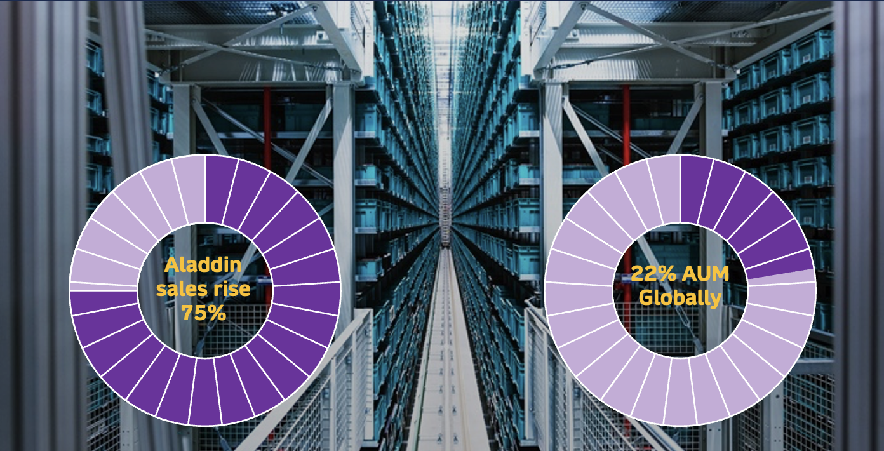
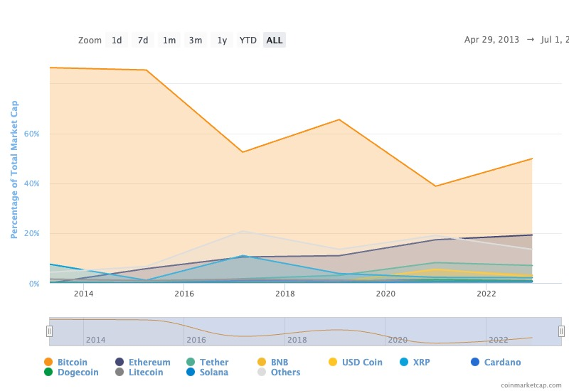

# BlackRock's Aladdin, Old Dog New Tricks 

## Table of contents
* [Overview and Origin](#overview-and-origin)
* [Business Activities](#business-activities)
* [Landscape](#landscape)
* [Results](#results)
* [Recommendations](#Recommendations)

___
## Overview and Origin
BlackRock was founded in 1988 by eight founders, Larry Fink, Robert Kapito, Susan Wagner, Barbara Novick, Ben Golub, Hugh Frater, Ralph Schlosstein, and Keith Anderson ([BlackRock History, 2023](https://www.zippia.com/blackrock-careers-904178/history/)). BlackRock operates in the asset management domain managing over 9 trillion USD ([Ghosh, 2023](https://www.pionline.com/money-management/blackrock-posts-aum-909-trillion-first-quarter-down-5-last-year)) as of the end of quarter one 2023, AUM globally is approximately USD 97t ([Boston Consulting Group, 2023](https://www.bcg.com/press/15may2023-global-asset-management-transform-to-thrive)). The Assets Under Management (AUM) are invested from an array of clients including governments, insurance and pension funds and individual investors. BlackRock has recently shifted its focus towards an environmental, social and governance (ESG) approach with investment management, involving sustainability considerations in its largely data-driven decision-making process. BlackRock also provides risk management and financial advisory services to its diverse base of clients to improve financial outcomes in periods of increased market volatility ([BlackRock, 2023](https://www.blackrock.com/au/individual/about-us/about-blackrock?cid=ppc:blk_au:google:sitelink&gclid=Cj0KCQjwqNqkBhDlARIsAFaxvwzenzNPRQYTBbA18cl00Ed_abSKIyXay6zSEA6ZM5h_6tbcdltkO6gaAtxEEALw_wcB&gclsrc=aw.ds)). BlackRock's additional key service is the Aladdin (Asset, Liability and Debt and Derivative Investment Network) the investment management platform provides institutional or individual users with a streamlined experience when managing wealth. As a result of BlackRock’s influence in financial markets, there is some debate around its role in the global financial ecosystem.

>*“The firm's girth also threatens to attract the gaze of regulators”* - [Durodié, 2020](https://www.cognitivefinance.ai/single-post/aladdin-and-the-genius-that-is-larry-fink)
___
## Business Activities

BlackRock’s Aladdin is the investment management tool of choice for over 55,000 investment professionals and 200 institutional clients ([BlackRock, 2022](https://www.blackrock.com/aladdin/offerings/aladdin-overview#:~:text=As%20an%20end%2Dto%2Dend,investment%20professionals%20around%20the%20world)) . The platform assists users with portfolio, risk and data management, compliance, regulations and client servicing. Aladdin’s latest ability is ESG integration enabling customers to factor ESG analytics into investment decision-making. Sustainable business operations are imperative for corporations to future-proof their positions. Recently structured tax provisions such as the inflation reduction act are passed to support investment into renewable energy transition and sustainable technologies([EY, 2023](https://www.ey.com/en_us/sustainability/esg-evolution?WT.mc_id=10821174&AA.tsrc=paidsearch&gad=1&gclid=Cj0KCQjwqNqkBhDlARIsAFaxvwzzuVXmtVx8oJZiMcuSA82GJW0Ih_b0gi5asVFJWSbApFqVketOCrkaAjjiEALw_wcB)). Therefore, investors obtaining insight into tax policies with ESG strategies provide an opportunity for differentiated investment outcomes. BlackRock’s Aladdin positions itself between the legislative change and investors to support ESG investments and accelerate economic prosperity in this sector.

The Aladdin platform utilises AI, natural language processing (NLP), and extract, transform and load (ELP) operations to tailor investment insights for clients. AI techniques are introduced into Aladdin to “…simulate various market scenarios, stress test portfolios, and identify potential sources of risk.”([Adventuremington, 2023](https://medium.com/@remingtondunlap/blackrocks-all-powerful-ai-fab3f53eb830)) The incorporation of AI into decision making is arguably one of the highest value adds to the platform, contributing to the great reputation that BlackRock has established for best-in-class risk analytics. 

NLP practices are utilised with deep learning models and AI to take human interactions, such as speech, process it and return data that computers can process. The implementation of such NLP is to collect information distributed by humans from sources similar to “…news feeds, economic indicators, and social media platforms" ([Ayeshchohan, 2023](https://medium.com/@ayeshchohan2/unleashing-the-power-of-aladdin-exploring-the-technology-driving-blackrocks-success-5d0c0450188c))  Aladdin digests extracted information to recognise patterns and extrapolate fluctuations in financial markets. Lastly ETL is used to extract data from various data points some include end products from NPL, APIs tied to the stock market and existing data storages ([Talend, 2019](https://www.youtube.com/watch?v=a5C-Bw8y9gM&t=24s)). Transformation of the data to a standardised input then the data is loaded to Aladdin. Aladdin specifically incorporates ETL to maintain regulatory and reporting compliance with both client and governing requirements. 

___
## Landscape
BlackRock’s Aladdin provides an array of services that justify a position in multiple domains within the financial industry. The discipline that BlackRock's Aladdin ticks the most boxes with is asset management. As technology applications continue to advance and our dependence on technology grows, innovations within the industry progress quickly. Key trends in asset management ([Hobart & Zwick et al. 2022](https://www.oliverwyman.com/our-expertise/insights/2023/jan/asset-management-trends-2023.html)) encompass the optimisation of processes through digital transformation, implementation of AI, Machine learning and improvement in quantitative analysis. Machine learning systems and AI are often implemented to support another trend in the industry, improving client experience and satisfaction with service. Clients of asset management firms are also shifting toward a ‘greener’ investment portfolio, "...putting their money where their values are "([Investopedia, 2023](https://www.investopedia.com/terms/e/environmental-social-and-governance-esg-criteria.asp#:~:text=Environmental%2C%20social%2C%20and%20governance%20(ESG)%20investing%20is%20used,products%20that%20employ%20ESG%20principles)). Growing awareness of environmental and social impacts on financial performance requires firms to demonstrate ESG consideration in investment decisions and offer ESG-concentrated investments.

> *"Costs decreased up to 30% via process automation, automated trade survelance and cheaper data management"* - [Snowflake, 2021](https://www.snowflake.com/blog/blackrock-and-snowflake-partner-to-unlock-the-value-of-data-for-the-investment-management-industry/?utm_source=blackrock&utm_medium=referral&utm_campaign=powered-by-snowflake-blackrock)

When selecting an investment management platform there is no perfect solution, but Aladdin provides five arguments for itself to be the platform of choice. BlackRock’s Aladdin risk management services are supported by almost 35 years of advisory at the pinnacle of finance. Aladdin also provides the full range of asset coverage that any BlackRock client can gain access to mutual funds and exchange-traded funds (ETF). Their extensive portfolio of big data and capital enables Aladdin to provide the highest echelon of data connectivity, and real-time and historic qualitative and quantitative insights into equities. Furthermore, the provided data analytics within the ESG space is unrivalled for investors in executing sustainable investments. Finally, Aladdin’s integration with BlackRock’s ecosystem enables all users to access investment products, insights and reporting functions. While these services might be billable to competitors, BlackRock’s capital offers them as a philanthropic gesture.

___
## Results
The success of BlackRock and rival firm operations can be reviewed from a plethora of metrics, key measurements that both the firm and publications assess are AUM, and the assets distribution across equities, return on investment (ROI) and ESG scores ([CRAFT, 2023](https://craft.co/blackrock/operating-metrics)). From their performance over the last five fiscal years the firm has returned a total of $1.8t usd on investment communicated through the published [Annaul Report 2022](https://www.annualreports.com/Company/blackrock). AUM has grown more than 250% this decade contributing to their 7,700% return on BlackRock stock since IPO in 23 years. Competitor Northern Trust [AUM (2022)](https://www.northerntrust.com/content/dam/northerntrust/pws/nt/documents/about-us/2022-financial-highlights.pdf) declined $350b usd in recent years, Fidelity Investments [AUM (2022)](https://www.statista.com/statistics/1260831/fidelity-aua-type/) also dropped $1.2t usd between the two previous fiscal years. 

MSCI audit assess asset management firms to provide “…clarity as they sharpen their focus on the financial impact of climate change and awareness…” ([MSCI, 2023](https://www.msci.com/who-we-are/about-us)) results demonstrate BlackRock receiving [AA ratings 4 out of 5 previous years](https://www.msci.com/our-solutions/esg-investing/esg-ratings-climate-search-tool/issuer/blackrock-inc/IID000000002159799%20/), the rating of a leader. Prior mentioned competitors result through the same assessment scored as Berkshire Hathaway BB, Fidelity Investment BB and Northern Trust AA. Despite BlackRock generating less revenue than competitors their AUM is growing faster, and trends suggest that this is because of their success in ESG investments and transparency. 

> *"...clients are increasingly looking for investment solutions that reflect not only their financial goals but also their values"* - [J.P. Morgan, 2023](https://am.jpmorgan.com/au/en/asset-management/adv/funds/global-macro-sustainable-fund/?utm_source=jpmam-sem-google&utm_medium=all-mixed&utm_campaign=au-en-bauglobalmacrosustainablefund-acq&utm_content=esgnonbrandexact&gclid=CjwKCAjw-vmkBhBMEiwAlrMeF8DoXZxDHkH-PkEHPET7PHQp-RYo69gGnsvL6gXUwFdXYn4smKnQ5xoC_IcQAvD_BwE)
___
## Recommendations
Within the last year BlackRock selected Coinbase to provide Aladdin institutional and individual clients the ability to trade digital assets through their platform. Currently Aladdin clients can only deal with Bitcoin in the commencement phase of their partnership with Coinbase ([Coinbase, 2022](https://www.coinbase.com/blog/coinbase-selected-by-blackrock-provide-aladdin-clients-access-to-crypto-trading-and-custody-via)). It is advised that BlackRock expand their services to support a plethora of cryptocurrency and digital assets. 

Records of cryptocurrency transactions on Binance show that major currencies traded are expanding rapidly([Binance, 2023](https://www.binance.com/en-AU/altcoins/tradable)), as seen in figure 1.1. This evolution in the digital asset market presents an opportunity to share access with clients and pioneer investments in digital assets. Large fluctuations in the digital asset market attract young investors to the market. As a pillar of investment management in conventional money markets it is wise to expand influence to encompass digital financial markets in a similar manner and capture young investors in the movement too.

Servicing this platform would not require any new technology but the implementation of new infrastructure that can monitor market movements and trading volumes via Aladdin. Technological infrastructure that will need to be developed includes APIs that are digestible by Aladdin and cheaper or ‘lite’ versions of Aladdin with digestible GUI and lower fees to attract younger investors to the platform. 

