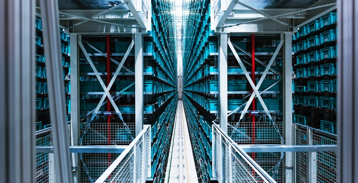

# Title
Blackrock's Aladdin, old dog - new tricks 
## Overview and Origin

* What is the name of the company?
 
Blackrock inc.
* When was the company incorporated?
1988 aladdin was launced with Blackrock
* Who are the founders of the company?
the program aladdin was created by the investment back blackrock
* How did the idea for the company (or project) come about?
Aladdin was developed to enable clients to view all their investments with precison and risk insights into their portfolios 
* How is the company funded? How much funding have they received?
the compnay in publically listed and aladdin currently manages approximately $21t usd as of 2021

## Business Activities

* What specific financial problem is the company or project trying to solve?
Aladdin allows teams across investments, trading, operations, administration, risk, compliance, and corporate oversight to use a consistent process and share the same data.  specifically a software for portfolio management 
Providing consistent oversight of the portfolio and enabling a standardised approach to decision making of that portfolio while also highlighting risks within that portfolio.

* Who is the company's intended customer?  Is there any information about the market size of this set of customers?
institutional investors including asset managers, pension funds, insurers and corporate treasurers.

* What solution does this company offer that their competitors do not or cannot offer? (What is the unfair advantage they utilise?)
 and getting ahead of — emerging customer and market trends. Climate change and sustainability likely rank among the most pressing.

* Which technologies are they currently using, and how are they implementing them? (This may take a little bit of sleuthing–– you may want to search the company’s engineering blog or use sites like StackShare to find this information.)
Since the start of 2020, Aladdin has added nearly 30 high-level sustainability index scores from leading data providers. They’ve integrated new ESG data fields from groups like MSCI and Sustainalytics into the platform. And they are partnering to expand the offering, including a strategic partnership with Clarity AI (a tech-driven sustainability measurement start-up) and the acquisition of Baringa Partner’s Climate Change Scenario Mode

## Landscape

* What domain of the financial industry is the company in?
Asset management 

* What have been the major trends and innovations of this domain over the last 5–10 years? https://www.oliverwyman.com/our-expertise/insights/2023/jan/asset-management-trends-2023.html 
- cutting costs with auotmation
- targetting carbon neutral targets - carbon credits 
- Cryptocurrency distributed ledger technology

* What are the other major companies in this domain?
Charles schwab, northern trust, fidelity investments, State street, vangaurd, berkshire hathaway & 

## Results

* What has been the business impact of this company so far?
the business impact of aladdin 
- aladdin has drawn business from additional sources currentlty influencing 10% of global assets under management 

* What are some of the core metrics that companies in this domain use to measure success? How is your company performing, based on these metrics?
BlackRock key operating metrics including Countries Covered, environmental, social and governance score (ESG), and technology stack - https://craft.co/blackrock/operating-metrics

* How is your company performing relative to competitors in the same domain?
Very well - it is black rock

## Recommendations

* If you were to advise the company, what products or services would you suggest they offer? (This could be something that a competitor offers, or use your imagination!)
* Why do you think that offering this product or service would benefit the company? SOURCEFORGE.NET
* What technologies would this additional product or service utilise?
* Why are these technologies appropriate for your solution?
1. TwoGap is a next-generation asset management platform created with blockchain technology.
2. Trades occur through smart contracts -> All transactions are documented on the TwoGap blockchain.
3. TwoGap outcompetes Aladdin in all three asset management silos.
Implement an asset manager that uses blockchain technology. And this is where TwoGap comes in. TwoGap is a next-generation asset management platform created with blockchain technology. Trades occur through smart contracts meaning all transactions are documented on the TwoGap blockchain. TwoGap outcompetes Aladdin in all three asset management silos: Research Silo, Marketing and Technical Model

 
